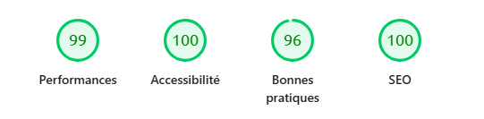
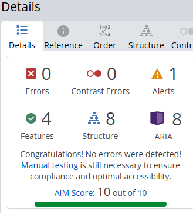

# PROJET OPENCLASSROOMS - Portfolio de développeur 

## Présentation du projet

Ce portfolio est ma vitrine professionnelle en ligne, conçu et développé de A à Z pour présenter mon profil, mes projets et mes compétences en tant que développeur Front-End spécialisé React.
Au-delà d'un simple CV en ligne, il s'agit d'une démonstration technique concrète : architecture React avec TypeScript, animations Framer Motion, responsive mobile-first, formulaire de contact intégré via EmailJS, et déploiement continu sur Vercel. Chaque choix technique reflète mes convictions en matière de qualité de code, d'expérience utilisateur et d'attention au détail.
Le projet est structuré autour de plusieurs sections — présentation, parcours, projets, compétences et contact — accessibles via une navigation fluide adaptée desktop et mobile. Les projets présentés incluent des réalisations issues de ma formation OpenClassrooms et bientôt des projets personnels, chacun documenté avec son contexte, ses objectifs et sa stack technique.

## Lancer le projet localement 

1. Clonez le dépôt
2. Installez les dépendances avec `npm install`
3. Lancez le projet avec `npm run dev`
4. Ouvrez votre navigateur à l'adresse `http://localhost:5173`

## Stack utilisée
- **ReactJS/TypeScript**
- T**ailwindCSS**
- **Motion** (ex-Framer Motion) pour les animations
- **React Hook Form** + **Zod** pour le typage, la gestion et la validation du formulaire de contact
- **EmailJS** pour l'envoi de mail via le formulaire de contact
- **React Vertical Timeline** pour la page Parcours
- **Sonner** pour le toast de la page Contact
- **Verce**l pour le déploiement continu
- **FontAwesome** pour les différentes icônes

## Rapport WAVE et Lighthouse

